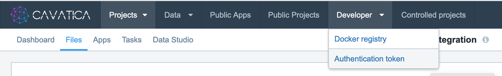

# utilitybeltcavatica

A bunch of helper functions for working with the sbg cavatica platform

## Installation

```{r}
install.packages("remotes") # Can skip if you already have 'remotes' package installed
remotes::install_github("selkamand/utilitybeltcavatica")
```

## Usage

This package extends functionality of the `sevenbridges` package on bioconductor.

### Getting Started with Sevenbridges

#### Set up cavatica credentials

Create a new file at: `~/.sevenbridges/credentials`

Add the following contents:

    [default]
    api_endpoint = https://cavatica-api.sbgenomics.com/v2
    auth_token   = my_cav_auth_token

`my_cav_auth_token` can be generated from web interface (hosted [here](https://cavatica.sbgenomics.com)):



#### Load Libraries

Jump into R load up the libraries we need

```{r}
library(sevenbridges)   # This library is automatically installed when you install this package
library(utilitybeltcavatica)
```

#### Connect to your project of interest

First lets list all all our projects

```{r}
a <- Auth(from="file",platform = "cavatica")

message("\nPossible Projects:")
a$project()
```

Then choose one of these to connect to:

```{r}
project <- a$project(id = "my_project_id")

message("\nProject Selected:")
project
```

Now we're all set to start using any functions in either the **sevenbridges** or **utilitybeltcavatica** packages. Examples of the latter are described below.

### Find File By FilePath

All functions described bellow are vectorised

```{r}
 # Get File Object
find_file_using_filepath(project, filepath)

# Get File Identifier
find_fileid_using_filepath(project, filepath)
```
